# Ghanshyam Parihar - Portfolio

## Projects
### 1. BeBestTherapy App
- **Tech Stack:** React Native
- **Features:** In-app purchase
- **📱 Android Screenshots :**
 

   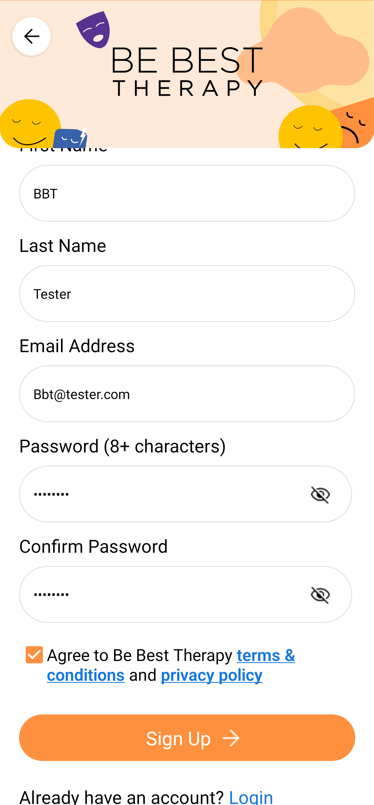
   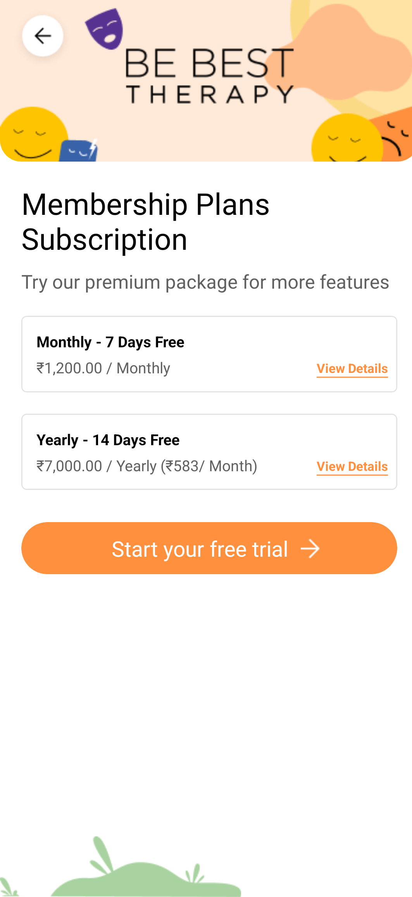
   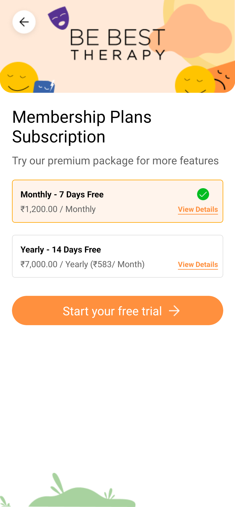
   
   
   
   
   
   
   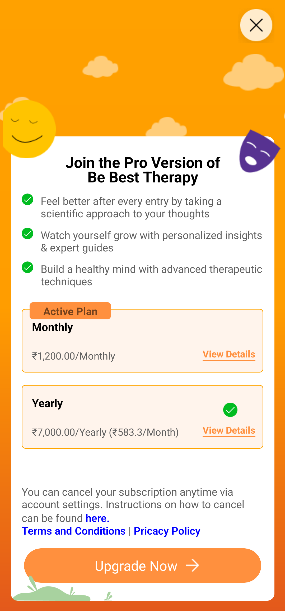
   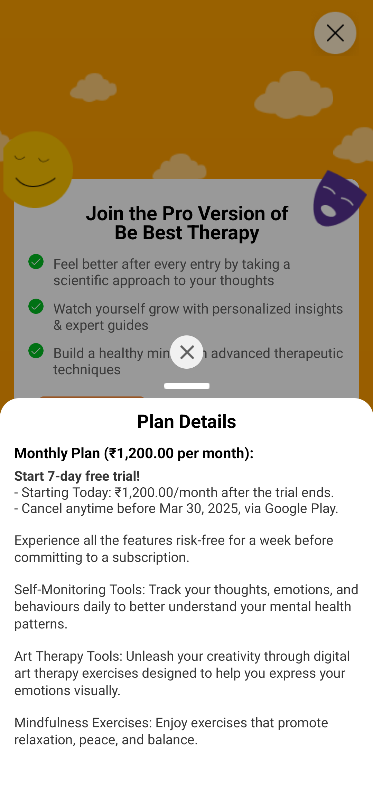
   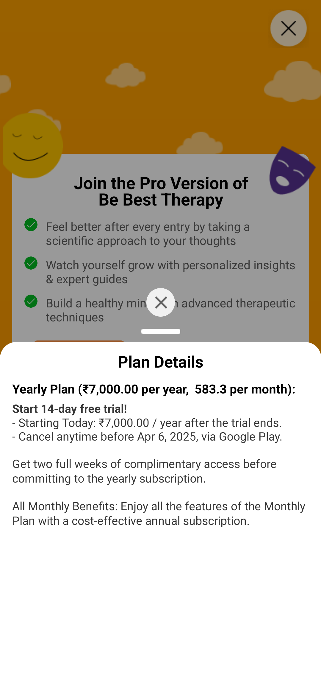
   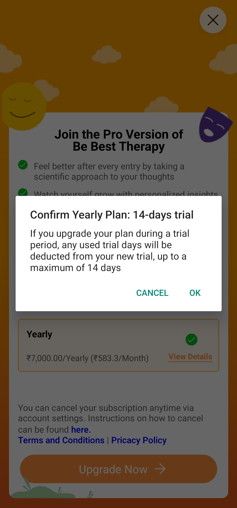
   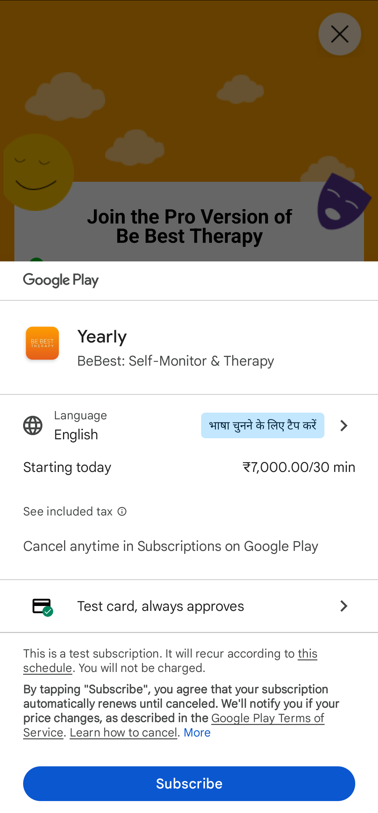
   
   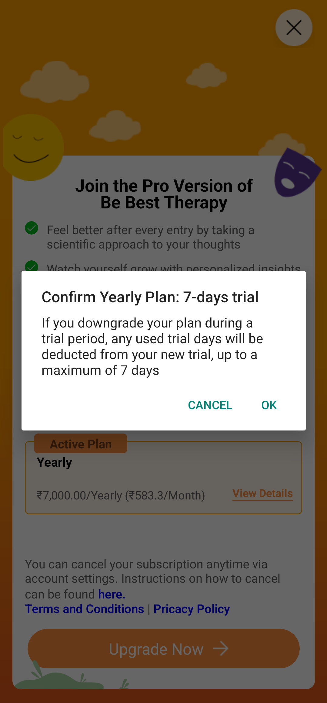
   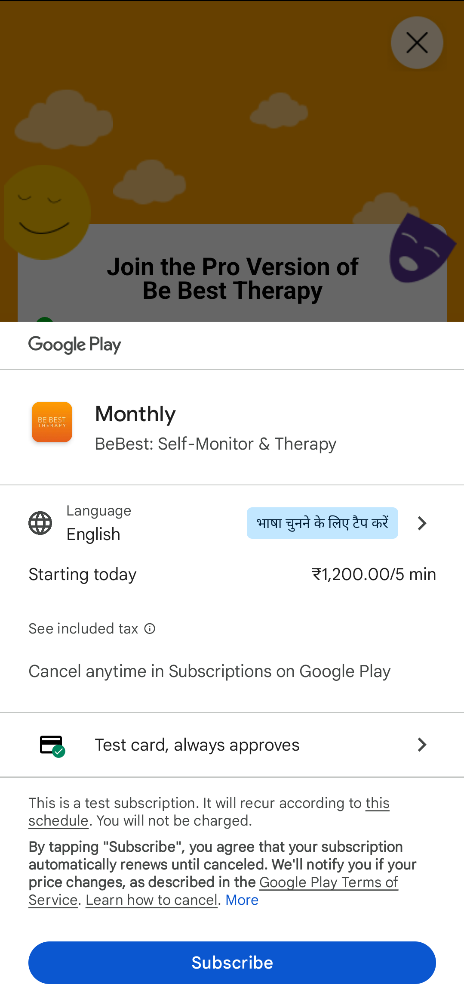

- **🍏 iOS Screenshots :**
 

   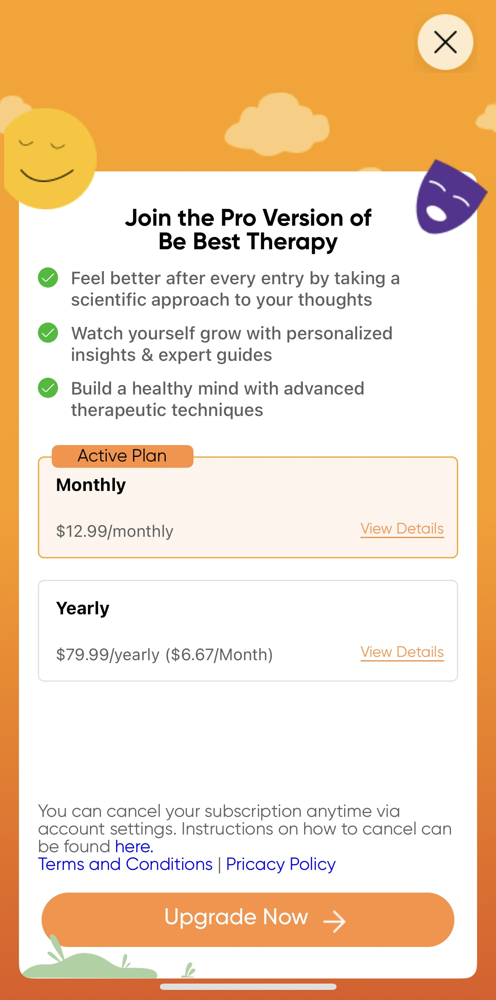
   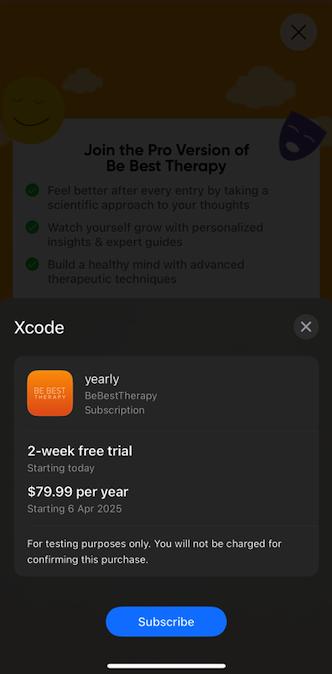
   

### 2. BaruNet
- **Tech Stack:** React Native, SQLit
- **Features:** Real-time YouTube streaming, Offline Reading
  - **📱 Android Screenshots :**
 
 Coming soon... 

- **🍏 iOS Screenshots :**
 
 Coming soon... 

